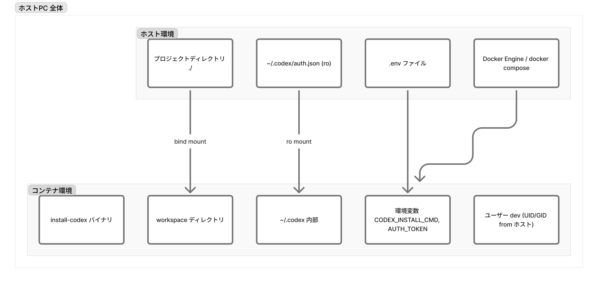

# Codex コンテナセットアップ

macOS 上でプロジェクトディレクトリを編集しながら、コンテナ内で Codex を動かすための最小構成です。



## 必要条件
- Docker Desktop（または Docker Engine + docker compose プラグイン）
- Cursor / VS Code（任意。いつも通りフォルダを開いてターミナルを使えます）

## クイックスタート
1. `.env.example` を `.env` にコピーして内容を編集します。
   - `HOST_UID` / `HOST_GID`: macOS で `id -u` / `id -g` を実行した値。
   - `CODEX_INSTALL_CMD`: コンテナ内で Codex をインストールするコマンド（既定値は `npm install -g @openai/codex`）。イメージのビルド時に自動で実行されるため、CLI のインストール方法をここで決めてください。
   - ホストに保存されている `~/.codex/auth.json` をそのまま使う場合は、絶対パスを `CODEX_AUTH_FILE` に設定します。
2. イメージをビルドしてコンテナを起動します。
   ```bash
   docker compose up --build -d
   ```
3. コンテナに入ります。
   ```bash
   docker compose exec codex bash
   ```

## Codex のインストール方法
`install-codex` は `CODEX_INSTALL_CMD` に指定したコマンドをそのまま実行します（`docker compose build` 時に自動実行されます）。  
デフォルトでは `npm install -g @openai/codex` を実行します。コンテナには Node.js 18 / npm 9 系があらかじめ入っており、グローバルインストールはユーザー権限のまま実行できます。
独自バイナリを使いたい場合は、ホストの `./bin/codex` に配置すると `/usr/local/bin/codex` にコピーされます。
`CODEX_INSTALL_CMD` を空にして `./bin/codex` も用意していない場合は、ビルド時の自動実行はスキップされるため、コンテナ内で `install-codex` を手動実行してください。

## トークンによるログイン
- `docker compose up` でコンテナを起動すると、トークンが `codex` コマンドから参照できる環境変数として渡されます。
- トークンの環境変数名は Codex の公式ドキュメントに合わせて調整してください（例: `CODEX_API_KEY` など）。
- ブラウザログイン後に生成される `~/.codex/auth.json` を直接使いたい場合は、`.env` の `CODEX_AUTH_FILE` にホスト上の絶対パスを設定すると、コンテナ内の `/home/dev/.codex/auth.json` として読み取り専用でマウントされます。

## 便利なコマンド
- 依存関係を変更したら再ビルド: `docker compose build`
- 作業終了時はコンテナを停止: `docker compose down`
- 状態をリセットしたい場合は再ビルドすれば十分です（名前付きボリュームは使用していません）。

## Codex チャットの終了方法
- CLI で対話モードを終了したい場合は、`exit` と入力するか `Ctrl+D`（EOF）を送信します。
- シェル上で `Ctrl+C` を押せば現在の Codex コマンドを強制終了できます。
